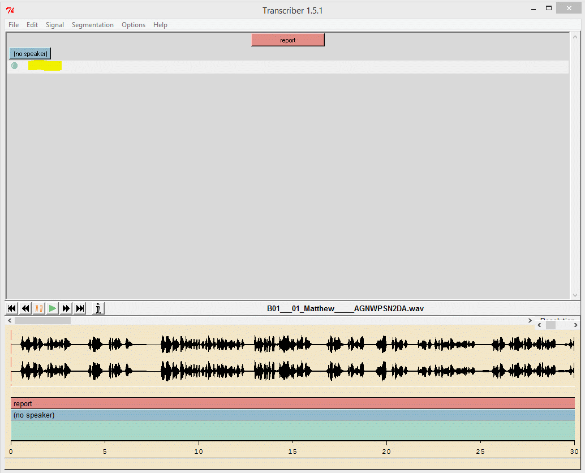
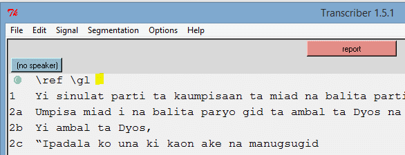
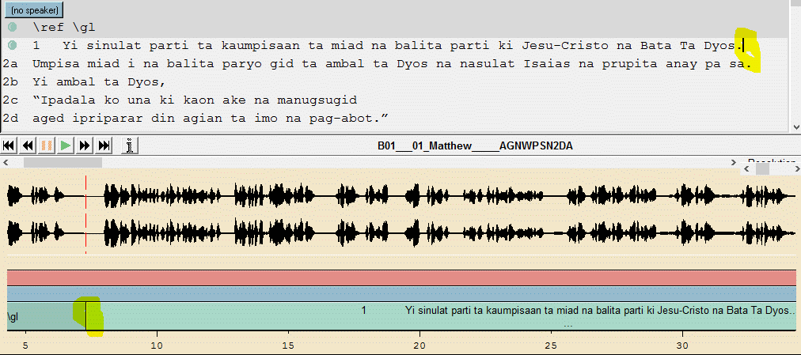

# transcriber-timing-assistant
Transcriber Timing Assistant to create timing files in Transcriber for use with Scripture App Builder

## Using Transcriber to get timings for SAB
#### An integrated, no typing method of creating Scripture App Builder timing files

### Summary

Transcriber along with a few AutoHotKey hotkey macros provides an easy tool to create timing files for SAB. With Audacity you have to use a variety of key strokes for each segment added. With the use of a right mouse click macro you can insert a timing point and move the cursor in the text to the next place.Four actions for one mouse click.
Demo videos: https://youtu.be/TDIY_ufCME0 https://youtu.be/sy3LTk2rFqI 

### Main Prerequisites

#### Install the following required files:

Transcriber v 1.5.1 http://sourceforge.net/projects/trans/
TranscriberTimingAssistant.exe https://github.com/indiamcq/transcriber-timing-assistant/master

#### Recomend installing:

WinFF http://winff.org/html_new/
This paper assumes you can manage the multiple file that will be generated.

### Setup a project

After installing Transcriber place TranscriberTimingAssistant.exe in a place convenient for you, and make a short cut to it, so you can start it easily. 

Transcriber works with mp3 files but seems to get out of timing with them. It seems to have no issues with WAV files. I recommend you use WAV files. If you only have MP3 files convert them to WAV files with WinFF or your favourite Audio converter.

Start the TranscriberTimingAssistant.exe macro program.

You should see an icon appear in the in the System tray.

The macro has three hot keys:

* Right mouse Click = Left mouse click, enter, del, end
* Number pad plus key= enter, del, end
* Space bar = tab
* 
Note these keys only work while in any program starting with Transcriber.

Start Transcriber
Open the WAV file for a chapter.




* Now open the phrase file you exported from SAB that matches this chapter in a text editor like Notepad.
* Copy the whole text and paste into the white space beside the green dot. Highlighted in yellow.
* Move the cursor to the end of the first line. Where the yellow highlighting is.
* Save the file to the folder you want, just accept the name as it matches the audio file.



The actual text will start after the introductory material. In the above project about 7 seconds into the audio.

With your cursor in the text at the end of the \ref        \gl line right mouse click where the audio starts or let it play until it almost starts and press the number pad plus key.

The mouse will insert the timing point at the mouse pointer and the plus key will in sert the break at the playback line. Either of these actions also move the text cursor to the end of the next segment of text. At times the cursor may jump to the end. Make sure you move it back to the end of the top line in the light grey area.



The text has been divided in the top by the green dot and in the bottom by the line highlighted by yellow. Note the new cursor position highlighted at the end of the top line in the light grey area.

You can play/stop by pressing space or tab. You can guess the breaks without listening, but you need to check your guesses by listening to some segments.

If you get the break position wrong. Hold down the Ctrl key and click and drag the line to the correct position.

Save periodically.

I don’t use the Number pad plus key as I am too slow. I find more accuracy using the right mouse click method.

No more typing. Yeah!

Next Converting to a usable text timing file.

### Conversion to usable text files

#### Conversion tools and method 1

Java if not installed
Saxon http://sourceforge.net/projects/saxon/files/latest/download?source=files
XSLT script https://github.com/indiamcq/transcriber-timing-assistant/
Convertion batch file https://github.com/indiamcq/transcriber-timing-assistant/
DTD file https://github.com/indiamcq/transcriber-timing-assistant/

Choose a conversion folder.

Place the last three file above in that folder. Also from the Saxon download zip place the saxon9HE.jar file.

Now add in all the files you created with Transcriber with the .trs extension into that same folder.
In Windows Explorer hold down the shift key and right click on the folder where all the above files are. Select near the top *Open command window here*. In the command prompt that appears type process-trs.cmd and press enter.

In the folder are all the timing files for each chapter you placed in the folder. They are ready for inclusion in SAB.

#### Conversion tools and method 2

NoteTab Light http://www.notetab.com/get.php?ntl
NoteTab clipbook  https://github.com/indiamcq/transcriber-timing-assistant/

Install NoteTab Light.
Copy the clipbook to C:\Users\%username%\AppData\Roaming\NoteTab Light\Libraries

When you are finished each chapter after save.
Click File/Export/Export to LIMSI label.

When you are all done with a book or all the books, Open NoteTab Light.
From Windows Explorer highlight and drag and drop all the files into NoteTab Light.
Select the SAB-label2timing clipbook then double click the Convert Files clip.
Click on File/Save All

All the files should be ready for SAB.

### Key Advantages of Transcriber method

*There is only on program to interact with. Transcriber moves the audio and the text to keep both in the viewing area.
* It is the most integrated environment.
* Having the text line length visible near the WAV shape aids in guessing the next breakpoint.
* You only generally have to do right clicks. And those click can be exactly where you want them.
* Transcriber works on Linux. Though you will have to find another macro program.

### Disadvantage with Transcriber

* The program is somewhat dated and superseded but it works for this usage. It has some bugs in it still. It is not longer being updated.
* The most annoying feature is that the text cursor jumps to the end of the unsegmented text when you move the timing points at times. (Let me know if you figure out why.)
* I once lost a completed transcription file that was previously saved by not paying attention to dialogs that came up. Have not reproduced error.
* You can’t do start time and end time. You can only record the start time. If you are after perfection this is not the tool. * But you could do the first pass in Transcriber and then open in Audacity.
* Set up of end conversion is extra work.

### Appendix

#### AutoHotKey script
```
  ; Transcriber hotkeys for segmenting Scripture for Scripture App Builder
  ; for stand alone use
  ;
  ; Written by Ian McQuay
  ; 2015-Jun-04
  ; Revised by IM 2015-Jun-11
  ;
  ; Set the menu icon
  menu tray, Icon, t.ico
  ; not need new icon
 #SingleInstance force
  #p::Pause                               ; Windows key p   Pauses execution of script
   
  :c?*:zx::ExitApp                      ; Exit the current script
   
  ; preparation
  window=Transcriber
  SetTitleMatchMode, 1
    ; Hotkeys start with a $ so they don't fire themselves when not on Transcriber.
  $RButton::
      SetKeyDelay, 200
      IfWinActive, Transcriber
-     {
          send, {LButton}{enter}{del}{End}
      } else {
          send, {RButton}
      }
      return
  $NumpadAdd::
      SetKeyDelay, 200
      IfWinActive, Transcriber
-     {
          send, {enter}{del}{End}
      } else {
          send, {NumpadAdd}
      }
      return
  $Space::
      SetKeyDelay, 200
      IfWinActive, Transcriber
-     {
          send, {tab}
      } else {
          send, {space}
      }
      return
  ;
```


